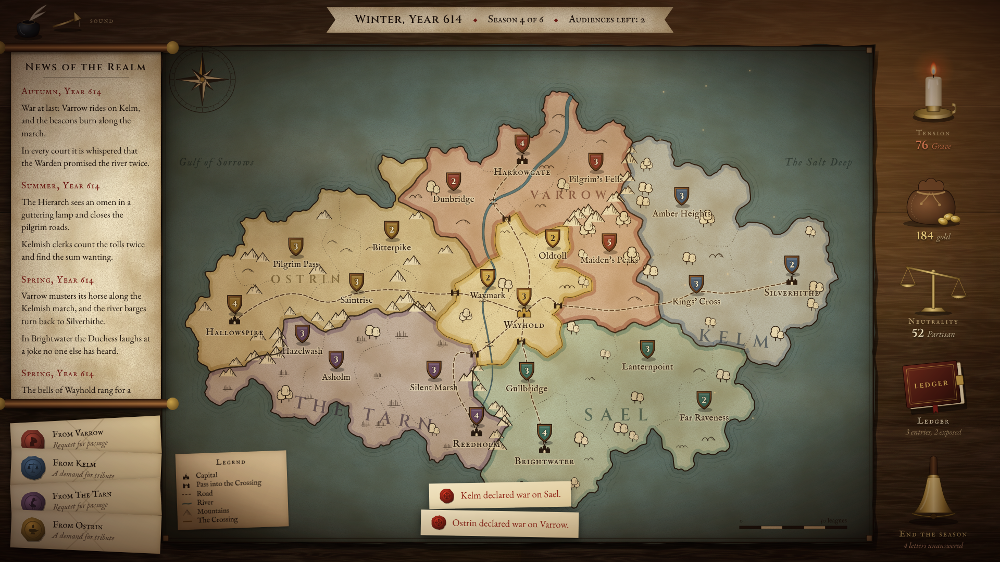

# Diplomaps

*Start a war without firing a shot.*

You rule **the Crossing**, a small neutral valley at the heart of a generated map. Every road and mountain pass
between five larger nations (Varrow, Kelm, Sael, The Tarn and Ostrin) runs through your land. You have no real army:
only words, gold, passage rights and letters. Hold audiences with rulers voiced by AI, promise, flatter, warn and lie,
then watch your words spread from court to court. Six seasons. Broker peace, or quietly set your neighbours at each
other's throats, without getting caught.



## Quick start

```bash
npm install
cp .env.example .env.local      # then put your OpenAI key in .env.local
npm run dev                     # game and API together at http://localhost:5173
```

That is the only command you need. `npm run dev` serves the game and the `/api` functions from one Vite server;
`.env.local` is re-read on every API request, so adding a key does not need a restart.

Without a key the game still runs: the title screen says *"The ravens cannot fly"*, rulers are called away, nations
watch and wait, and the chronicle writes itself from templates.

### Environment

| Variable | Default | Purpose |
| --- | --- | --- |
| `OPENAI_API_KEY` | (none) | Required for AI rulers. Read only on the server; never sent to the browser. |
| `MODEL_FAST` | `gpt-5.6-luna` | Audiences, nation actions, promise extraction. |
| `MODEL_RICH` | `gpt-5.6-terra` | Chronicle, ruler verdicts, epilogue. |
| `AI_REASONING` | (per call) | Optional: force a reasoning effort (`none`, `low`, `medium`) for every call. |
| `RATE_LIMIT_PER_MINUTE` | `60` | Per-IP limit on `/api` requests. |

## How to play

1. **Open a dossier.** Click a nation on the map to see its ruler, how they regard you, and their red line.
2. **Hold audiences.** Up to three per season, four messages each. Every promise and claim you make is written in
   your ledger. Lies are caught when the wrong courts compare notes.
3. **Answer letters.** Grant or refuse passage through the Crossing; pay or refuse tribute. Each choice has a cost.
4. **Ring the bell.** The five courts decide what to do, wars are fought, rumours travel the roads, and the chronicle
   records it all. After six seasons (or sooner, if Wayhold falls or you are unmasked) your ending is revealed.

## Scripts

| Command | What it does |
| --- | --- |
| `npm run dev` | Game and API on one dev server. |
| `npm run build` | Typecheck, then build the static site into `dist/`. |
| `npm run preview` | Serve the production build, with the API mounted. |
| `npm run typecheck` | Strict TypeScript over the app, server and tooling projects. |
| `npm run lint` | ESLint, including the engine purity rules (no `Math.random`, no DOM, no network). |
| `npm run simulate` | 200 headless games with random valid actions; prints balance statistics. |
| `npm run playtest` | Plays one full game through the UI with Playwright (needs `npm run dev` running and `npx playwright install chromium`). Writes screenshots and a report to `playtest/`. |

## Deploying to Vercel

1. Push the repository to GitHub and import it in Vercel. The Vite framework preset is detected from `vercel.json`
   (build command `npm run build`, output `dist`).
2. In **Project Settings > Environment Variables**, add `OPENAI_API_KEY`, and optionally `MODEL_FAST` and `MODEL_RICH`.
3. Deploy. The functions in `/api` are thin wrappers around `server/handlers`; each allows up to 60 seconds.

The same handlers run locally inside Vite, so there is no need for `vercel dev`.

## Optional art and sound

Everything is drawn with CSS and SVG, and every sound has a quiet synthesized stand-in, so the game is complete
without any files. Drop any of these into `public/` and they replace their stand-ins automatically:

| File | Replaces |
| --- | --- |
| `public/assets/wood.jpg` | The table's wood grain (shown darkened, `cover`). |
| `public/assets/parchment.jpg` | The parchment texture on the map sheet, scroll, letters and dossiers. |
| `public/assets/seal-varrow.png`, `seal-kelm.png`, `seal-sael.png`, `seal-tarn.png`, `seal-ostrin.png` | Each nation's wax seal (transparent PNG, square). |
| `public/assets/portrait-varrow.png`, `portrait-kelm.png`, `portrait-sael.png`, `portrait-tarn.png`, `portrait-ostrin.png` | The ink silhouettes of each ruler (portrait ratio, about 5:6). |
| `public/audio/ambient.mp3` | Fire crackle and room tone (looped). |
| `public/audio/paper.mp3` | Parchment sliding (dossiers, letters, the ledger). |
| `public/audio/quill.mp3` | Writing (sending words, the chronicle inking in). |
| `public/audio/bell.mp3` | Ending a season. |
| `public/audio/drums.mp3` | The heartbeat when tension passes 70. |
| `public/audio/doors.mp3` | Entering and leaving an audience. |
| `public/audio/coins.mp3` | Offering a gift. |

Missing files are never requested. The mute toggle is the brass candle snuffer by the ink pot (or press **M**).

## Cost per game

Every AI call logs its token usage and estimated cost to the server console, with a running session total.

A full game makes about 127 calls: roughly 52 audience replies, 15 assessments, 15 extractions, 30 nation actions,
6 chronicle entries and 1 ending. Measured prompt sizes are about 1.4k input tokens per audience reply, 1.6k per
nation action, 1.1k per extraction, 0.8k per assessment, 0.4k per chronicle and 1k for the ending.

| Model | Input tokens | Output tokens (incl. reasoning) | Cost |
| --- | --- | --- | --- |
| `gpt-5.6-luna` | ~158k | ~29k | ~$0.07 |
| `gpt-5.6-terra` | ~4k | ~3k | ~$0.04 |
| **Total** | **~162k** | **~32k** | **~$0.11 per game** |

This is an **estimate**: the input sizes are measured from the real prompts, but output and reasoning lengths are
assumed. The server log gives the exact figure for a real game.

## How it is built

- **Vite, React and strict TypeScript**, Tailwind CSS v4 (design tokens in `src/styles/index.css`), Zustand, Motion,
  d3-delaunay, Zod and Howler.
- **`src/engine`** is pure, seeded game logic that runs in the browser and in Node. It covers map generation,
  season resolution, battles, economy, gossip, endings and the AI context builders. Every tunable number is in
  `src/engine/config.ts`.
- **`server/`** holds the only OpenAI code (Responses API, Zod structured outputs, streamed audiences), the prompt
  files (`server/prompts`, with one voice file per ruler), a rate limiter and the Vite plugin that serves the API.
  **`api/`** re-exports the same handlers as Vercel Functions.
- The browser sends structured game data only; the server builds every prompt. Every AI call has a timeout, one retry,
  Zod validation and an in-world fallback, so the game never freezes.

Screenshots of every screen at 1280×720 and 1920×1080 are in [`docs/screenshots`](docs/screenshots).
