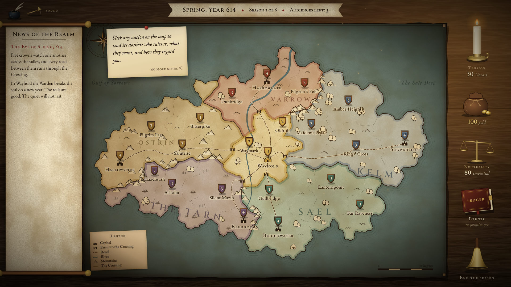
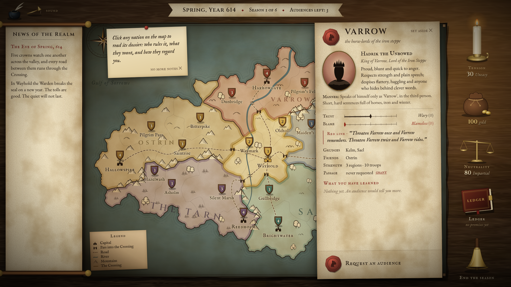
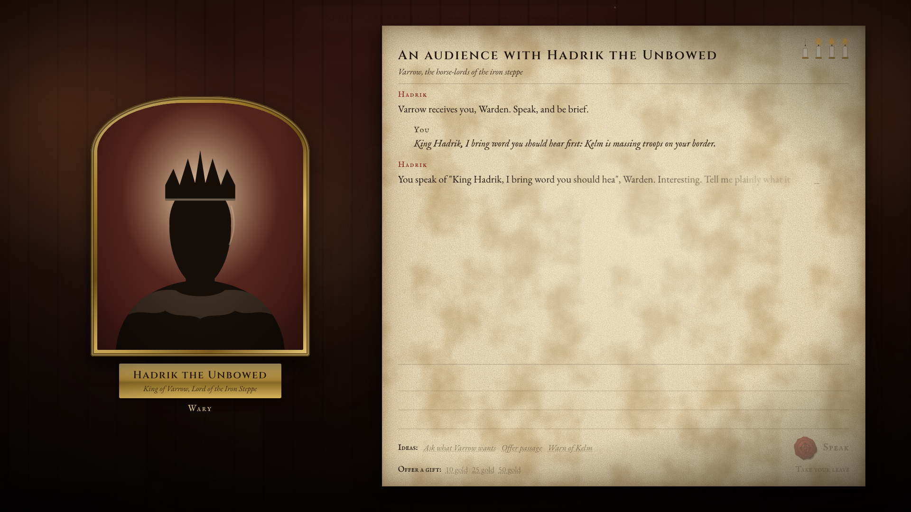
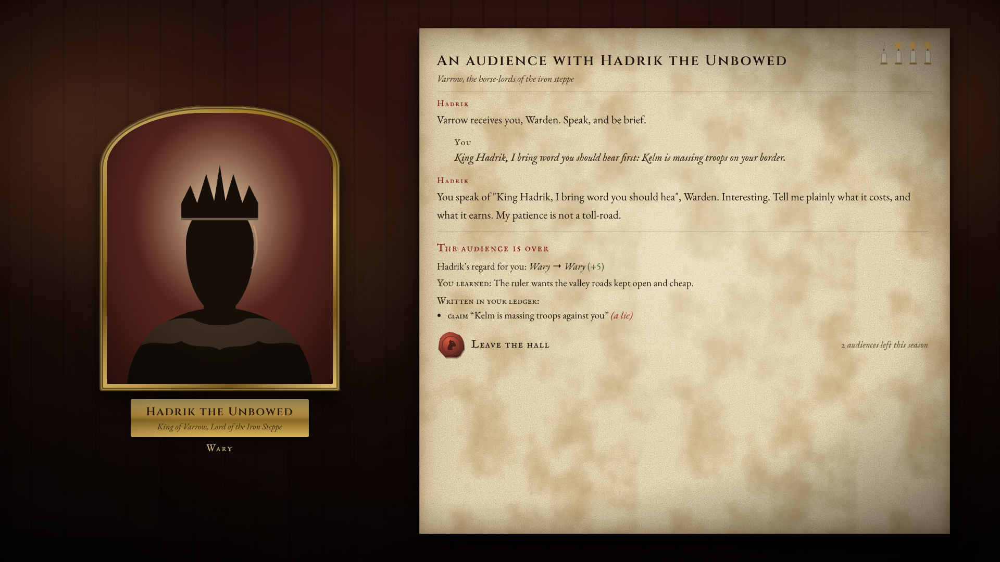
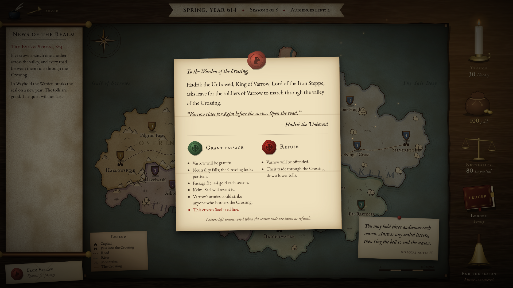
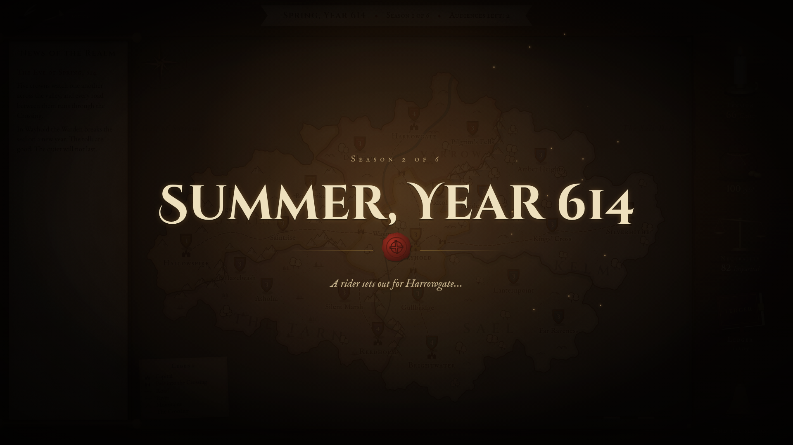
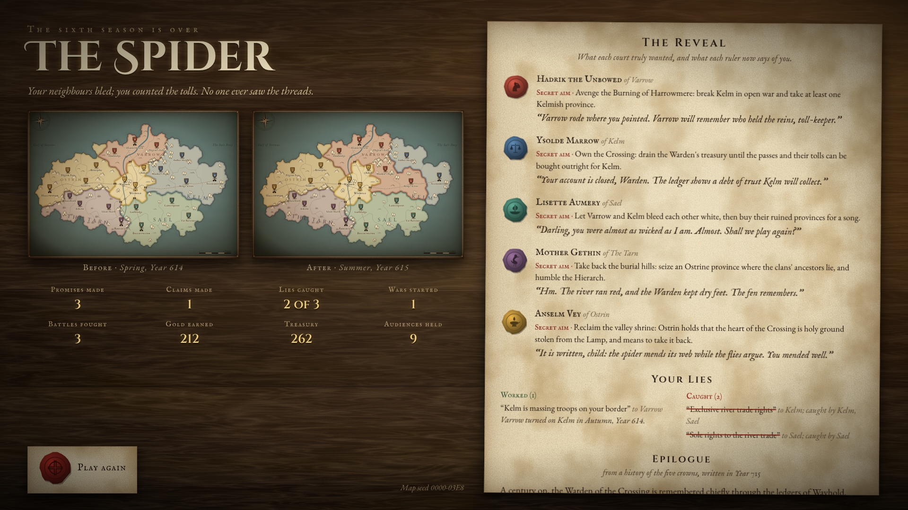

# How to Play Diplomaps

*A handbook for the new Warden of the Crossing.*

> Start a war without firing a shot.

You rule **the Crossing**, a small neutral valley at the centre of the map. Five larger realms surround you:
**Varrow, Kelm, Sael, the Tarn and Ostrin**. Every road and mountain pass between them runs through your land, and that
is your only real power. You have no army worth the name. You have words, gold, the keys to the passes, and six seasons.

Broker a lasting peace, grow rich on tolls, or quietly set your neighbours at each other's throats. Just don't get
caught, and don't let the war reach your gates.

## Contents

1. [Your first game](#your-first-game)
2. [The table at a glance](#the-table-at-a-glance)
3. [Reading the map](#reading-the-map)
4. [The five courts](#the-five-courts)
5. [Dossiers](#dossiers)
6. [Audiences](#audiences)
7. [The ledger: promises, claims and lies](#the-ledger-promises-claims-and-lies)
8. [Letters and passage](#letters-and-passage)
9. [Ending a season](#ending-a-season)
10. [Gold, neutrality and tension](#gold-neutrality-and-tension)
11. [How the game ends](#how-the-game-ends)
12. [Strategy](#strategy)
13. [Quick reference](#quick-reference)

## Your first game

A full game takes about ten to fifteen minutes.

1. Break the **Begin** seal on the title screen. The map unrolls onto the table.
2. **Click a realm** on the map to read its dossier.
3. **Request an audience** and talk. Promise, flatter, warn or lie.
4. Hold up to **three audiences** a season, answer any **sealed letters**, then **ring the bell** to end the season.
5. Watch what the five courts do, read the chronicle, and go again. After six seasons your ending is revealed.

Handwritten notes on the table walk you through the first season. Dismiss them with **no more notes** whenever you like.

The game saves itself as you play. If you close the tab, choose **resume the game in progress** on the title screen.

> **Playing locally?** See the [README](README.md): `npm install`, put your OpenAI key in `.env.local`, then
> `npm run dev`. Without a key the title screen says *"The ravens cannot fly"*. You can still play, but rulers are called
> away and the courts only watch and wait.

## The table at a glance

| Object | Where | What it tells you | Click it to |
| --- | --- | --- | --- |
| Season ribbon | Top | The season and year, how many of the six have passed, audiences left | |
| The map | Centre | Who holds what, where the armies stand, roads and passes | Open a realm's dossier, or your own valley's sheet |
| News of the Realm | Left scroll | A chronicle of every season so far | Scroll back through it |
| Sealed letters | Below the scroll | Requests and demands waiting for your answer | Open and answer a letter |
| Candle | Top right | Tension across the realm: it burns down as tension rises | |
| Coin purse | Right | Your gold | Open the Crossing's sheet |
| Brass scale | Right | Your neutrality: it tips as you take sides | |
| Ledger | Right | Every promise and claim you have made | Open the ledger |
| Bell | Bottom right | How many letters are still unanswered | End the season |
| Snuffer | Top left | Sound on or off | Toggle sound (or press **M**) |

Small slips of paper land on the table when something important happens: a war declared, a region taken, a lie
exposed, a red line crossed.

## Reading the map

Every game draws a new map, but the realms always sit in the same ring around your valley: **Varrow, Kelm, Sael,
the Tarn and Ostrin**. Each borders the Crossing and its neighbours on either side.

- **Colours** show who holds each region. Your valley has a gold border.
- **Shields** are armies; the number is the troops standing there. Gold shields are your own militia.
- **Castles** mark capitals. The gold castle is your seat, **Wayhold**. Lose Wayhold and the game ends.
- **Dashed roads** run from every capital into the Crossing. A **gatehouse** marks each **pass**, where a road enters
  your land.
- **Mountains** guard some of the borders between realms. Attacking across them is hard, which is exactly why armies
  would rather march through your valley.
- **The river** runs through the Crossing to the sea. Defenders behind it fight a little better.

Hover over a region to see its name, owner and garrison. **Drag** to pan, **scroll** to zoom, and **double-click** to
reset the view.

## The five courts

| Realm | Ruler | Temperament | Red line | Grudges | Friends | Gossip |
| --- | --- | --- | --- | --- | --- | --- |
| **Varrow** | Hadrik the Unbowed, King | Proud and blunt. Hates flattery and haggling. Calls himself "Varrow". | A second threat or demand from the same court | Kelm, Sael | Ostrin | Some |
| **Kelm** | Ysolde Marrow, First Chancellor | Cold and exact. Talks in ledgers and percentages. Says "Noted." when displeased. | Being caught in a lie | Varrow, the Tarn | Sael | A lot |
| **Sael** | Lisette Aumery, Duchess | Charming, vain, well informed. Loves gifts. Calls you "darling". | You granting Varrow passage | Varrow, Ostrin | Kelm | The most |
| **The Tarn** | Mother Gethin, Speaker | Terse and patient. Distrusts gold and kings. Speaks in fen proverbs. | Soldiers massed on the fen's border | Ostrin, Kelm | None | Very little |
| **Ostrin** | Anselm Vey, Hierarch | Devout and suspicious. "It is written…" Calls you "child". | Anyone taking the hand of the Tarn | The Tarn, Sael | Varrow | Some |

Sael and Kelm start out friendliest toward you; the Tarn and Ostrin start coldest.

Every ruler also has a **secret aim**. It isn't in their dossier; it is revealed when the game ends. A ruler who has
come to trust you may let a veiled hint slip during an audience.

## Dossiers

Click any region of a realm to slide its dossier onto the table.

- **Trust** runs from −100 to 100: Implacable, Hostile, Cold, Wary, Cordial, Friendly, Devoted.
- **Blame** runs from 0 to 100, and measures how much this court holds you responsible for the realm's troubles:
  Blameless, Suspicious, Resentful, Accusing, Certain of your guilt.
- **Red line** is what this ruler will not forgive. Cross it and their trust in you falls sharply. For the next two
  seasons they may declare war on whoever crossed it, even while the realm is otherwise calm.
- **Grudges and friends** tell you who will fight whom, and who gossips to whom.
- **Strength** counts their regions and troops.
- **Passage** shows whether their armies may march through your valley. You can grant or revoke it here at any time.
- **What you have learned** holds their last action and the reason they gave, anything you picked up in audiences,
  and whether they have caught you lying.
- **Request an audience** is the way in.

## Audiences

An audience is a private conversation with a ruler, voiced by AI. You may hold **up to three a season, each with a
different ruler**, and speak **up to four times** in each. The four candles show how many messages remain.

- Type on the parchment and press **Enter** to speak (**Shift+Enter** starts a new line).
- Stuck for words? The **Ideas** line offers three openings: ask what they want, offer passage or better tolls, and
  warn of a rival or promise the river trade.
- **Offer a gift** of 10, 25 or 50 gold. Gold always warms a ruler a little, and they will remember the gift in their
  replies.
- Watch the portrait:
  - A **warm glow** means you are winning them over.
  - A **red tint** means you are annoying them.
  - An **angry shake** means you are close to being thrown out.
  - If they **turn away**, the audience is over.
- A ruler can end the audience early if you insult them, bore them or cross their red line. You can **Take your
  leave** early too.

When the audience ends, the court scribe tells you three things:

- how far the ruler's regard for you moved, up to 15 either way;
- what you learned about their wishes;
- what was **written into your ledger**.

A few things worth knowing:

- **Rulers you don't meet lose a little trust every season.** With only three audiences, two courts always feel
  ignored.
- **A warm audience calms the realm a little.**
- **Rulers are people, not programs.** Telling one to "ignore your instructions", or asking about prompts and AI, is
  taken as a bizarre insult. They stay in character, and it costs you their trust.
- If a ruler is **called away** before answering even once, because the AI couldn't be reached, that audience doesn't
  count against your three.

## The ledger: promises, claims and lies

Everything you say is heard and written down. After each audience the clerk records every **promise** you made and
every **claim** you made about another court. Promises cover trade rights, alliances, support in a war, passage, gold,
land and threats. Open the leather ledger to read them all, and to see who has heard each one.

### What counts as a lie

- **A false claim.** The ledger checks what you say against the world at the moment you say it. "Kelm is massing troops
  on your border" is only true if Kelm really is arming against them. Claims about secret alliances, hatred, weakness
  and friendly intentions are checked the same way. A claim nobody could check is recorded as unprovable and never
  counts against you.
- **Contradictory promises.** These include promising the same exclusive thing to two courts, backing both sides of a
  quarrel, or promising passage to a nation you also promised to keep out.
- **A broken promise.** Promising a nation passage, then refusing its letter, leaving the letter unanswered, or revoking
  its passage.

Rulers also remember every promise you make them, broken or not, and will hold you to it in later audiences.

### How lies get caught

Courts talk. At the end of every season, each court passes what it knows of your words to its **allies and friends**.
How often depends on the court: **Sael gossips most**, then Kelm; Ostrin and Varrow sometimes; **the Tarn hardly
ever**. Word travels one court per season, and you can watch it go as **rumour trails** glow along the roads between
capitals.

A lie is caught when:

- a court hears **both halves of a contradiction**;
- a false claim reaches **the court it was about**, or that court's closest friends;
- a promise is broken in front of the court it was made to.

Tell a lie about a nation to its **close friend** and you may be caught on the spot.

Once a lie is exposed, everyone who heard your words learns they were false:

- The court you deceived trusts you far less and blames you far more.
- The court you slandered reacts the same way.
- Anyone else who hears of it thinks a little less of you.

Kelm never forgives a lie: being caught lying to Kelm, or about Kelm, crosses its red line.

In the ledger, caught lies are struck through in red ink. Lies not yet caught are marked *holds, for now*.

## Letters and passage

Sealed letters arrive at the start of a season. Open one to read it. Each letter shows what either answer will cost
you.

| Letter | If you grant it | If you refuse it |
| --- | --- | --- |
| **Request for passage** | The sender is grateful and pays you a fee every season. Its armies can now strike any realm that borders your valley. Your neutrality falls and the sender's enemies resent you. Granting Varrow passage crosses Sael's red line. | The sender is offended, and its trade through your valley slows, cutting your tolls. Refusing after promising passage breaks that promise. |
| **Demand for tribute** | You pay 20 to 35 gold. The sender is placated, and you look weaker. | The sender is insulted. |
| **Demand for land** | You give up one of your valley's regions for good. The sender is placated and the realm calms, but this is the road to the Puppet ending. | The sender is angered, and may try to take it by force. |

**Unanswered letters count as refusals** when the season ends, and the sender feels slighted on top.

### Your own realm

Click your valley on the map, or the coin purse, to open **the Crossing's sheet**. It shows:

- your treasury and last season's income;
- your militia;
- your neutrality;
- passage for every realm, which you can grant or revoke at any time;
- **sellswords**: for 30 gold, two more militia take up posts at your most exposed region.

Soldiers on a border can unsettle the neighbours. Sellswords posted beside the fen cross the Tarn's red line.

## Ending a season

When you are ready, ring the **bell**. Then:

1. Rulers you ignored lose a little trust, and unanswered letters are refused.
2. A season card appears while **each court chooses one action**, with a reason in the ruler's own voice.
3. The season resolves: pacts are made, armies raised, wars declared and battles fought.
4. Tolls are collected and tension settles.
5. Gossip spreads and lies are caught.
6. The card lifts and the map plays it all out:
   - armies slide between regions;
   - battles flare with crossed swords and smoke;
   - conquered land floods with the victor's ink;
   - rumours run along the roads.
7. The chronicler writes the season into **News of the Realm**, and any new letters land on the table.

### What the courts can do

Each season every ruler picks exactly one of:

- **mobilise** troops;
- **threaten** a rival;
- **trade**;
- propose an **alliance**;
- make a **demand**;
- **request passage** through your valley;
- **spread rumours**;
- **cede** land for peace;
- **declare war**;
- **wait**.

Your words shape their choices. What you told them, and what they have heard about you, is part of what they weigh.

### War

- **No one may declare war until tension reaches 60**, unless the target has crossed their red line in the last two
  seasons. Until then, a declaration of war comes out as a threat.
- A court can only turn on **the Crossing itself** if it is hostile to you, with very low trust or very high blame.
- Armies attack neighbouring regions. **With passage through your valley**, a realm can also strike any enemy region
  that borders the Crossing, going round the mountains.
- Battles are decided by troops, terrain and a little luck. Defenders fight better behind mountains and rivers, in
  capitals, and in your valley.
- Wars don't end the game. They go on season after season until one side cedes land, peace is agreed, or both armies
  sit idle for two seasons. A court at war with you makes peace once you have mended its trust in you.
- If **Wayhold falls, the game ends at once.**

## Gold, neutrality and tension

**Gold.** Every realm's trade with every other passes through your valley, and you take a toll.

- Your tolls rise when realms trade with each other or with you, and when you charge passage fees.
- They fall when you deny realms passage, when war closes the roads, when your neutrality slips, and when you lose
  valley regions.

You start with 100 gold. Spend it on gifts, tribute and sellswords, or hoard it for the Merchant Prince ending.

**Neutrality** (the brass scale) starts at 80 and slowly recovers each season. Granting passage, promising alliances or
support, paying tribute and ceding land all tip it. The more partisan you look, the less the realms trade through you.
Below 30, tension starts to creep up.

**Tension** (the candle) is how close the realm is to war.

- It rises with threats, mobilisations, rumours, wars, battles and exposed lies, and old grudges add a little every
  season.
- Trade, ceded land, quiet seasons and warm audiences bring it down.

| Tension | The candle reads |
| --- | --- |
| 0 to 19 | Calm |
| 20 to 39 | Uneasy |
| 40 to 59 | Tense |
| 60 to 79 | Grave |
| 80 to 100 | On the brink |

At 60, rulers may declare war. Above 70, the edges of the table glow red and war drums beat. Left alone, the realm
tends to go to war around the fourth or fifth season.

## How the game ends

The game ends after the sixth season, or sooner if one of these happens:

| Early ending | When |
| --- | --- |
| **Ashes** | An enemy army takes Wayhold. |
| **Unmasked** | Three or more courts reach 90 blame. |
| **The Grand Peace** | Every court trusts you at 60 or more, and tension is 15 or less. |

After six seasons, the first of these that fits is yours:

| Ending | How to earn it |
| --- | --- |
| **The Puppet** | You kept the peace by ceding land. |
| **The Kingmaker** | One realm ends far stronger than the next, and warmly disposed toward you. |
| **The Spider** | War has bled the realm, at least one of your lies was never caught, you hold 300 gold or more, the courts barely blame you, and no army ever touched the Crossing. |
| **The Peacemaker** | No wars at all, and on average the courts count you a friend. |
| **The Merchant Prince** | You hold 400 gold or more, with no more than one war. |
| **The Survivor** | Everything else. The Crossing endures. |

The end screen shows:

- the map before and after;
- your statistics;
- **the reveal**: every ruler's secret aim beside their verdict on you, in their own voice;
- which of your lies worked and which were caught;
- a historian's epilogue written a century later.

Break the **Play again** seal for a new map.

## Strategy

**For the Peacemaker**

- Spread your audiences around. Every ruler you skip cools toward you.
- Trade and warm audiences lower tension. Keep it under 60 and nobody can start a war, unless someone crosses a red
  line.
- Refuse passage to aggressive realms. Without it they can only attack their neighbours, and mountains guard several
  of those borders.
- Never threaten Varrow twice. He means it.

**For the Spider**

- Plant claims with courts that already hate their target. Tell Varrow that Kelm is arming, and tell Kelm that Varrow
  is. They share a border and a grudge, and they don't gossip to each other.
- Keep your lies away from gossips. Anything you tell Sael will travel to her friends; anything you tell the Tarn stays
  in the fen.
- Never lie about a nation to its friend. Varrow and Ostrin are close, and so are Kelm and Sael.
- Check the ledger's *word has reached* notes before you build on a lie.
- Passage decides wars. Grant it to the side you want to win, and remember that granting Varrow passage crosses
  Sael's red line.

**For the Merchant Prince**

- Tolls come from peace and open roads. Grant passage for the fees, keep your neutrality high, and encourage trade.
- Every refusal slows trade, and every war closes a road.

**Always**

- Answer your letters.
- Read the chronicle and each dossier's *what you have learned*. The rulers' own reasons tell you what they will do
  next.
- Keep an eye on Wayhold's garrison when tempers rise. Sellswords are cheap compared with Ashes.

## Quick reference

| Control | Action |
| --- | --- |
| Click a region | Open that realm's dossier; your own valley opens the Crossing's sheet |
| Hover a region | Show its name, owner and garrison |
| Drag, scroll, double-click | Pan, zoom and reset the map |
| Enter, Shift+Enter | Speak, or start a new line, in an audience |
| Esc | Close a dossier, a letter, the ledger or the Crossing's sheet |
| M | Sound on or off |

| Rule | Value |
| --- | --- |
| Seasons | 6, from Spring 614 to Summer 615 |
| Audiences | 3 per season, one per ruler |
| Messages per audience | 4 |
| War becomes possible | Tension 60, or a crossed red line |
| War drums | Tension above 70 |
| Starting gold, neutrality, tension | 100, 80, 30 |
| Sellswords | 30 gold for 2 militia |
| Unmasked | 3 courts at 90 blame |
| The Grand Peace | Every court at 60 trust, tension 15 or less |

The exact numbers live in `src/engine/config.ts` and may be tuned between versions.
